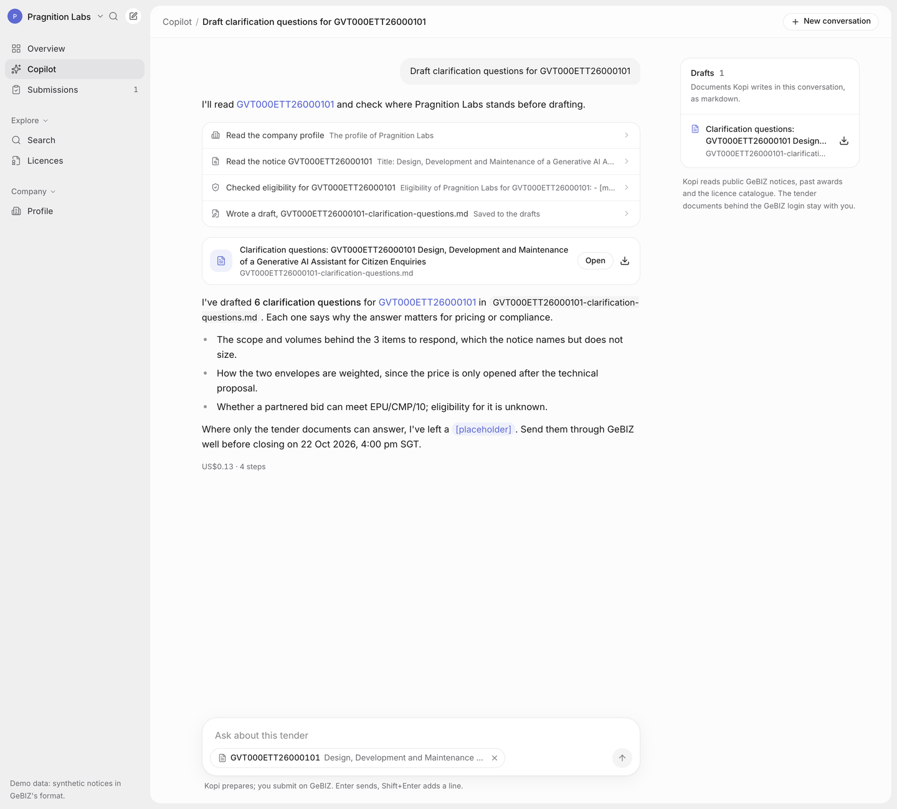

# Kopi — a copilot for Singapore government tenders

Kopi reads every open opportunity on GeBIZ, Singapore's procurement portal, and tells a
supplier's bid team what fits, whether they can bid, what licences they need, and what
similar tenders were actually awarded for. Its copilot then drafts the working documents of
the bid: clarification questions, a compliance matrix, a submission checklist.

**Live:** https://kopi.unv.run (the access code is in the submission email)

**Demo (3:58):** https://kopi.unv.run/demo/kopi-demo.mp4



Built in a day for the Pragnition Labs AI-Native Builder assessment, with coding agents
doing the work and me directing it. How that went, mistakes included, is in
[`planning/`](planning/) and [`logs/`](logs/).

---

## Run it

**No keys, no network.** The web app runs on synthetic fixtures in the browser:

```bash
cd web && npm ci && npm run dev        # http://localhost:3000, mock mode by default
```

**Backend and tests.** The tests are offline: fixtures, fakes, and NeedleDB's embedded engine.

```bash
cd backend && uv sync && uv run pytest -q           # 277 tests
make dev-api                                        # FastAPI over the fixtures at :8000
NEXT_PUBLIC_KOPI_API=http://127.0.0.1:8000 npm run dev   # (in web/) the UI against it
```

**Live stack.** Modal, NeedleDB, GeBIZ, Claude. See [docs/architecture.md](docs/architecture.md) and `backend/modal_app.py`.

```bash
cd backend && MODAL_PROFILE=<workspace> uv run --extra deploy modal deploy modal_app.py
```

## What it does

| Part | What you get | How |
|---|---|---|
| **Overview** | All ~730 open GeBIZ opportunities, searchable by meaning. Per tender: an AI brief with a BID / MAYBE / NO BID call | Qwen3 embeddings in NeedleDB, with a light BM25 boost. Claude Opus 5.5 structured output, **every quote checked against the notice by code** |
| **Permits & licences** | Can we bid? Met / not met / unknown for the closing date, GRA supply head and grade, BCA workhead and grade, and named or implied licences, each with a reason and a source. Plus 324 licences searchable by activity | Deterministic rules over the GRA and BCA tables and the GoBusiness catalogue. Live register lookups by company registration number (UEN) |
| **Drafting** | A copilot that searches, checks eligibility, reads notices and writes drafts you can download | Claude Agent SDK with Kopi's own MCP tools, in a locked-down Modal Sandbox |
| **Submissions** | Tenders you're pursuing, a checklist per tender built from the notice, deadlines in Singapore time, drafts linked | Rules (`kopi/checklist.py`), shared by the API and the copilot |


## How it works

```
GeBIZ open opportunities ──scrape (contacts dropped)──┐
data.gov.sg awards (18,464 rows → 12,052 tenders) ────┼─► Qwen3-Embedding-0.6B (L4, only what changed)
GoBusiness licences (324) ────────────────────────────┘        │  every 3 h, Modal cron
                                                               ▼
                                   Modal Volume: vectors (.npz), notices bundle, catalogue
                                                               │  loaded at start
                                                               ▼
   Next.js (static, kopi.unv.run) ──HTTPS──► FastAPI on Modal ──► NeedleDB (my vector DB, on Modal)
                                             │  search · tender · eligibility · market · overview
                                             │  POST /chat (SSE)
                                             ▼
                                   Modal Sandbox per conversation
                                   Claude Agent SDK, Kopi MCP tools, drafts/
                                   egress: Anthropic + Kopi API only
```

The full data flow is in [docs/architecture.md](docs/architecture.md), and the decisions
behind it (D1–D26) are in [planning/02-decisions.md](planning/02-decisions.md).

## Numbers

- **Retrieval** ([evals/RESULTS.md](evals/RESULTS.md)): 30 supplier queries over 12,052
  real awarded tenders, 1,546 pooled judgements.

  | Method | nDCG@10 | P@10 |
  |---|---:|---:|
  | **Qwen3-Embedding-0.6B** | **0.695** | **0.713** |
  | BGE-small-en-v1.5 | 0.609 | 0.610 |
  | BM25 | 0.594 | 0.607 |
  | Qwen3, domain-specific instruction | 0.444 | 0.537 |

  Adding the BM25 boost takes Qwen3 to **0.715**.
- **Search latency:** about 1 s end to end for a new query from a US laptop (0.6 s of that
  is the query embed on 4 vCPU), and 0.38 s for a repeated query.
- **Ingest:** the first cloud run embedded 5 new notices on an L4 and reused 12,703
  vectors. A NeedleDB restart reloads 13,103 vectors in 1.5 s.
- **AI overview:** about $0.055 and 19 s per tender, cached. Across 10 live overviews
  every call agreed with the rules, and verification caught every quote not in the notice.
- **Copilot turn:** $0.18 for "find IT tenders closing this month we're eligible for,
  then draft clarification questions". It ran 7 eligibility checks and wrote a
  14-question draft.

## Trade-offs I made

- **Rules before model.** Eligibility is code, not a prompt. The model explains and
  drafts; it doesn't decide who can bid. "Unknown" means the profile doesn't say, never "no".
- **Quotes are verified, not trusted.** Every quote Claude cites is matched against the
  notice text as normalised substrings. If one fails, it's shown as a warning and a BID is
  capped at MAYBE.
- **An open embedding model, measured on our own data.** Qwen3-0.6B is free and Apache
  2.0, beats OpenAI's text-embedding-3-large on MTEB, and here beat BGE-small and BM25.
  0.6B was chosen over 4B/8B so queries embed on CPU with no GPU on the request path.
- **My own vector DB** (NeedleDB) as a single-writer service. The vectors live on the
  Volume as `.npz` and NeedleDB runs on local disk, so no SQLite sits on a network
  filesystem.
- **A static front end.** No secret can reach the browser, and the site is just files.
- **The notice only.** Tender documents sit behind the GeBIZ login; Kopi says so wherever
  it matters.
- **No accounts.** The profile and the tracker live in the browser: no user database, no
  personal data stored.
- **Out of scope:** submitting on GeBIZ (Kopi prepares, the person submits), email
  alerts, and fine-tuning.

## Security

- **The copilot can't run shell commands or browse the web.** Its only built-in tools are
  Read, Write, Edit and Glob, fenced by a `PreToolUse` hook to its own workspace (writes
  go to `drafts/` only). Everything else is a read-only Kopi MCP tool.
- **One sandbox per conversation**, with egress limited to Anthropic and the Kopi API.
  Checked live: github.com, example.com and gebiz.gov.sg are blocked.
- **Scoped tokens.** A copilot turn gets a 20-minute token that can read data but can't
  chat, read drafts or spend Claude on overviews (403). The site is behind an access code
  (HMAC tokens), with per-token rate limits and per-caller caps.
- **Untrusted notice text.** It reaches a model only inside escaped `<notice>` delimiters.
  Two prompt-injection fixtures are in the tests, and live Claude flagged both.
- **Least-privilege data keys.** NeedleDB's admin key lives only in its own container.
  Ingest has a write key, the API a read key; the copilot has neither.
- **No personal data.** Officials' names, emails and phone numbers are dropped when a
  notice is scraped. No scraped dataset is committed: fixtures are synthetic, and the app
  sits behind an access code because notices carry a no-republication clause. The session
  logs quote short excerpts of notices where the agents inspected live data, with
  contact details removed.

## Weakest parts, and what I'd do next

1. **The hosted copilot is waiting on a credential.** Every piece is deployed and proven:
   the sandbox, egress, tokens, streaming and the drafts store. The live copilot needs the
   `kopi-claude` Modal secret (a Claude OAuth token from `claude setup-token`); until
   then it answers with a clear 503 and overviews use an extractive fallback. The same
   agent ran end to end locally against the live API.
2. **Quotes are checked for existence, not relevance.** Code can prove Claude's quote is
   in the notice, not that it supports the point. Two of 47 live reasons quoted real but
   irrelevant words. **Next:** a cheap second-pass judge, and showing quotes as "evidence
   found", never "proof".
3. **Injected text can buy retrieval rank.** A prompt-injection fixture ranked 4th for
   Pragnition in mock mode, because its injected words overlap the profile. The model
   ignores it, but ranking doesn't. **Next:** strip imperative "to the AI" sentences before
   embedding, and add a retrieval test for it.
4. **Latency.** A new query spends about 0.6 s embedding on CPU. **Next:** ONNX or int8 on
   x86, or a small always-warm GPU if usage justified it.
5. **The notice, not the documents.** The real requirements live in PDFs behind the GeBIZ
   login. **Next:** a supplier-side upload of the tender pack, parsed into the same checks.
6. **Next features:** daily email or Slack digests of new matches, a per-agency incumbent
   view, shared team profiles.

## How AI built this

- **The tools:**
  - Claude Code (Claude Opus 5.5) running inside **Universe**, my agent workspace, on its
    Software Factory board;
  - parallel task agents in git worktrees, and an independent reviewer agent on each of the
    five milestone-1 tasks (it found four real bugs the authors' checks had passed); later
    tasks were proven by their tests, the retrieval eval and live runs on the deployed API;
  - subagents with fresh context for the web pages and the overview.
- **Planning:** [`planning/`](planning/) holds the brief, the discovery research (every
  source probed with real requests), the decisions D1–D26, the superseded v1 plan, and one
  handoff per task.
- **Mistakes:** [`planning/04-ai-journal.md`](planning/04-ai-journal.md) sorts every
  mistake by what caught it: the reviewer agent, tests, the eval, live runs (where the
  fakes had hidden it), screenshots, and once the copilot itself.
- **Session logs:** [`logs/`](logs/) holds all 12 sessions (the main agent, two crew agents,
  five reviewers, four subagents), redacted by [`scripts/export_logs.py`](scripts/export_logs.py).
  [`logs/INDEX.md`](logs/INDEX.md) lists them and says what was removed.
