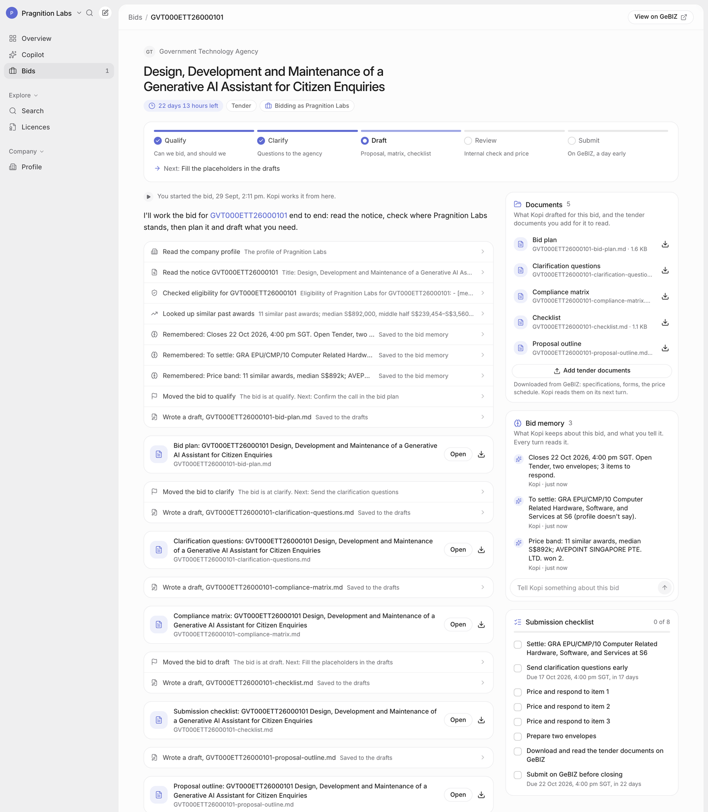
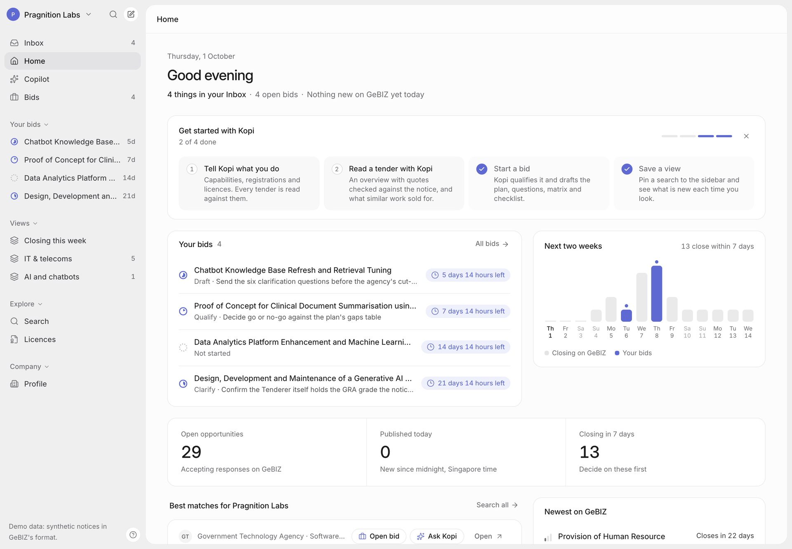
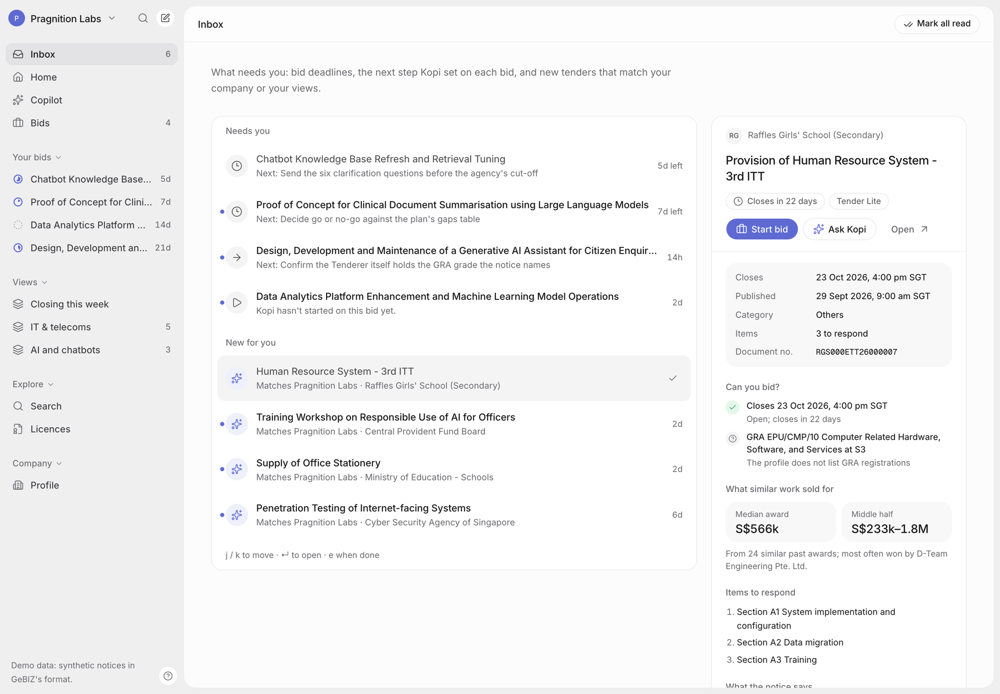
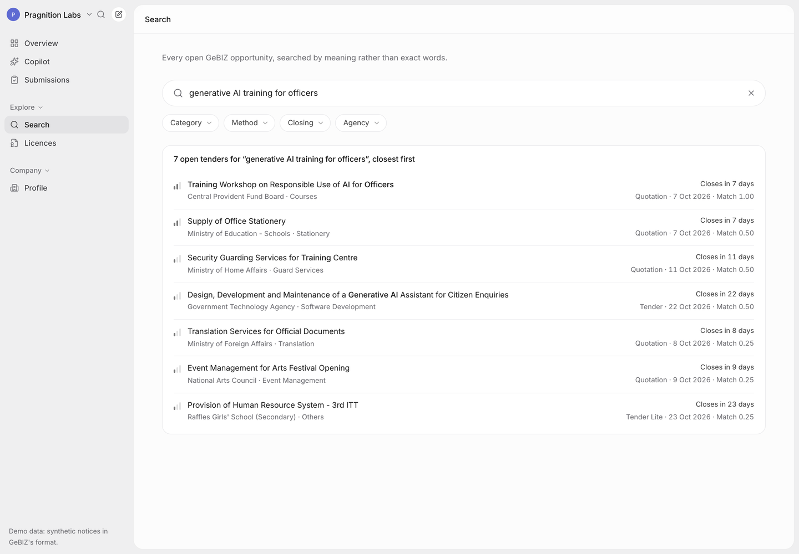
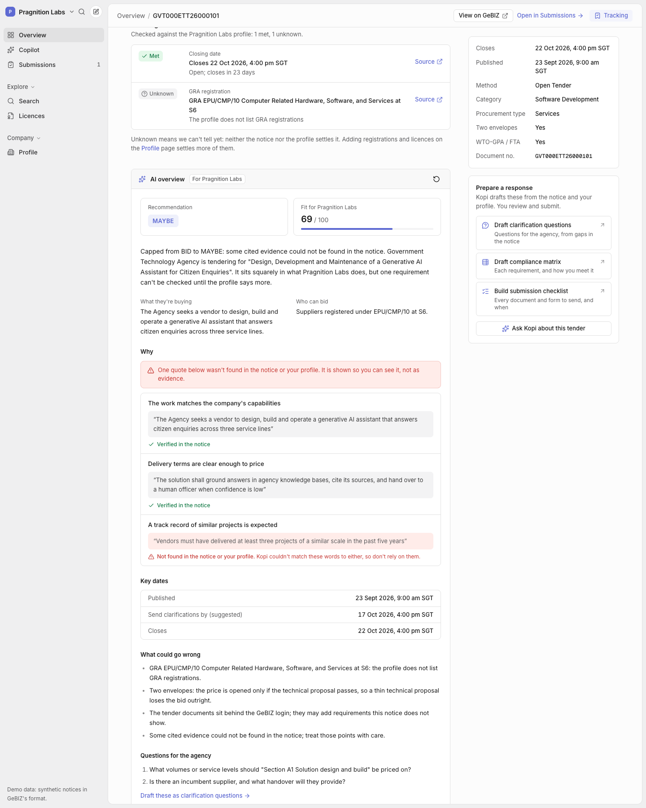

# Kopi — a copilot for Singapore government tenders

Kopi reads every open opportunity on GeBIZ, Singapore's procurement portal, and tells a
supplier's bid team what fits, whether they can bid, what licences they need, and what
similar tenders were actually awarded for. Start a bid and its copilot works the bid for
you. It qualifies the tender and writes a bid plan with a timeline back from closing. It
drafts clarification questions, a compliance matrix, a submission checklist and a proposal
outline, and keeps what it learns in a bid memory that it reads on every later turn.
Around it is a workspace:
- Home, built around your bids;
- an Inbox of what needs you;
- your bids in the sidebar with their stage;
- saved views that count what is new;
- ⌘K to search or jump anywhere.

**Live:** https://kopi.unv.run (the access code is in the submission email)

**Demo (3:56):** https://kopi.unv.run/demo/kopi-demo.mp4



Built in a day for the Pragnition Labs AI-Native Builder assessment, with coding agents
doing the work and me directing it. How that went, mistakes included, is in
[`planning/`](planning/) and [`logs/`](logs/).

---

## Run it

**No keys, no network.** The web app runs on synthetic fixtures in the browser:

```bash
cd web && npm ci && npm run dev        # http://localhost:3000, mock mode by default
```

**Backend and tests.** The tests are offline: fixtures, fakes, and NeedleDB's embedded engine.

```bash
cd backend && uv sync && uv run pytest -q           # 345 tests
make dev-api                                        # FastAPI over the fixtures at :8000
NEXT_PUBLIC_KOPI_API=http://127.0.0.1:8000 npm run dev   # (in web/) the UI against it
```

**CI** ([`.github/workflows/ci.yml`](.github/workflows/ci.yml)): the backend suite, then web lint and build. Run
step for step on a fresh clone of this repo at `e1912f6` (30 Sep 2026): 345 passed, lint
clean, build clean.

**Live stack.** Modal, NeedleDB, GeBIZ, Claude. See [docs/architecture.md](docs/architecture.md) and `backend/modal_app.py`.

```bash
cd backend && MODAL_PROFILE=<workspace> uv run --extra deploy modal deploy modal_app.py
```

## What it does

| Part | What you get | How |
|---|---|---|
| **Overview** | All ~730 open GeBIZ opportunities, searchable by meaning. Results are cards: eligibility for your company (blockers named), why it matched, what similar work sold for, closing, method; Start bid in one click; a preview pane and j/k keys. Per tender: an AI brief with a BID / MAYBE / NO BID call | Qwen3 embeddings in NeedleDB, with a light BM25 boost. Card insights load after the hits (25 in about 1–2 s, cached). Claude Opus 5.5 structured output, **every quote checked against the notice by code** |
| **Permits & licences** | Can we bid? Met / not met / unknown for the closing date, GRA supply head and grade, BCA workhead and grade, and named or implied licences, each with a reason and a source. Plus 324 licences searchable by activity | Deterministic rules over the GRA and BCA tables and the GoBusiness catalogue. Live register lookups by company registration number (UEN) |
| **Drafting** | A copilot that searches, checks eligibility, reads notices and writes drafts you can download | Claude Agent SDK with Kopi's own MCP tools, in a locked-down Modal Sandbox |
| **Bids** (submissions) | Start a bid and Kopi works it, as a chat with an artifacts panel on one page. It reads the notice, the rules and the market, saves the key facts, moves the stage (qualify → clarify → draft → review → submit), and writes a bid plan, clarification questions, a compliance matrix, a checklist and a proposal outline. **Each document types itself into the panel as the model writes it.** Upload the tender documents (PDFs preview in place) and it reads them. A bid memory holds its notes and yours. Every bid keeps its submission tasks and deadline in Singapore time | A bid playbook for the same agent, with `remember` and `set_bid_stage` tools. The memory, drafts and uploads live outside the sandbox and are restored into a fresh one, so a bid survives the copilot restarting |
| **Workspace** | Home: your bids with their stage and next step, a 14-day strip of GeBIZ closings with your deadlines marked, a get-started checklist, then the market. An **Inbox** of what needs you (bid deadlines, the next step Kopi set, bids not started, new tenders matching your company or a view) with a preview pane and j/k/e keys. A sidebar with **your bids** (stage ring, days left) and **saved views** that count what was published since you last looked. **⌘K** searches tenders by meaning, plus bids, licences, pages and actions for the tender you're on. `?` lists every shortcut, and toasts offer Undo | Worked out in the browser from the bids, their session memory and the same searches; no feed and no new service. Only views and read/done state are stored. A view's "match" is a hit within 0.12 of its best, and never below 0.30, which on live data drops the long tail every vector search returns |









## How it works

```
GeBIZ open opportunities ──scrape (contacts dropped)──┐
data.gov.sg awards (18,464 rows → 12,052 tenders) ────┼─► Qwen3-Embedding-0.6B (L4, only what changed)
GoBusiness licences (324) ────────────────────────────┘        │  every 3 h, Modal cron
                                                               ▼
                                   Modal Volume: vectors (.npz), notices bundle, catalogue
                                                               │  loaded at start
                                                               ▼
   Next.js (static, kopi.unv.run) ──HTTPS──► FastAPI on Modal ──► NeedleDB (my vector DB, on Modal)
                                             │  search · tender · eligibility · market · overview
                                             │  POST /chat (SSE)
                                             ▼
                                   Modal Sandbox per conversation
                                   Claude Agent SDK, Kopi MCP tools, drafts/
                                   egress: Anthropic + Kopi API only
```

The full data flow is in [docs/architecture.md](docs/architecture.md), and the decisions
behind it (D1–D30) are in [planning/02-decisions.md](planning/02-decisions.md).

## Numbers

- **Retrieval** ([evals/RESULTS.md](evals/RESULTS.md)): 30 supplier queries over 12,052
  real awarded tenders, 1,546 pooled judgements.

  | Method | nDCG@10 | P@10 |
  |---|---:|---:|
  | **Qwen3-Embedding-0.6B** | **0.695** | **0.713** |
  | BGE-small-en-v1.5 | 0.609 | 0.610 |
  | BM25 | 0.594 | 0.607 |
  | Qwen3, domain-specific instruction | 0.444 | 0.537 |

  Adding the BM25 boost takes Qwen3 to **0.715**.
- **Search latency:** about 1 s end to end for a new query from a US laptop (0.6 s of that
  is the query embed on 4 vCPU), and 0.38 s for a repeated query.
- **Ingest:** the first cloud run embedded 5 new notices on an L4 and reused 12,703
  vectors. A NeedleDB restart reloads 13,103 vectors in 1.5 s.
- **AI overview:** about $0.055 and 19 s per tender, cached. Across 10 live overviews
  every call agreed with the rules, and verification caught every quote not in the notice.
- **Copilot turn:** $0.18 for "find IT tenders closing this month we're eligible for,
  then draft clarification questions". It ran 7 eligibility checks and wrote a
  14-question draft.
- **A bid, worked end to end** (live data, real Opus, WSG000ETT26000004):
  - The kickoff took 98 s. It wrote the five documents and saved seven facts. Two of them
    the rules can't produce: the likely predecessor contract (S$501,025 in 2024) and the
    likely incumbent. It moved the bid to *clarify* with a dated next step.
  - For the second turn I added an ITT excerpt and a note ("we'd bid with a partner who
    holds GRA S6"), then deleted the sandbox. The new sandbox read the upload and its
    restored drafts. It caught that the ITT requires the Tenderer itself to hold S6, moved
    the clarification deadline to the ITT's 5 Oct, and rewrote the plan, questions and
    matrix. That turn took 87 s and cost US$0.36.
- **A bid on the published site** (MAS000ETT26000053, real Opus in the Modal sandbox, started
  from kopi.unv.run): the first event came after 16 s and the turn took 240 s, 23 steps and
  US$0.39. It saved 9 facts, wrote all five documents, and moved the bid to *clarify* with
  dated next steps.
- **Search cards:** 25 cards' eligibility, snippet and price band in about 2 s cold on the
  deployed API (11.5 s before bands came from each notice's stored vector), and
  milliseconds when cached.

## Trade-offs I made

- **Rules before model.** Eligibility is code, not a prompt. The model explains and
  drafts; it doesn't decide who can bid. "Unknown" means the profile doesn't say, never "no".
- **Quotes are verified, not trusted.** Every quote Claude cites is matched against the
  notice text as normalised substrings. If one fails, it's shown as a warning and a BID is
  capped at MAYBE.
- **An open embedding model, measured on our own data.** Qwen3-0.6B is free and Apache
  2.0, beats OpenAI's text-embedding-3-large on MTEB, and here beat BGE-small and BM25.
  0.6B was chosen over 4B/8B so queries embed on CPU with no GPU on the request path.
- **My own vector DB** (NeedleDB) as a single-writer service. The vectors live on the
  Volume as `.npz` and NeedleDB runs on local disk, so no SQLite sits on a network
  filesystem.
- **A static front end.** No secret can reach the browser, and the site is just files.
- **The notice only.** Tender documents sit behind the GeBIZ login; Kopi says so wherever
  it matters.
- **No accounts.** The profile and the tracker live in the browser: no user database, no
  personal data stored.
- **Out of scope:** submitting on GeBIZ (Kopi prepares, the person submits), email
  alerts, and fine-tuning.

## Security

- **The copilot can't run shell commands or browse the web.** Its only built-in tools are
  Read, Write, Edit and Glob, fenced by a `PreToolUse` hook to its own workspace (writes
  go to `drafts/` only). Everything else is a read-only Kopi MCP tool.
- **One sandbox per conversation**, with egress limited to Anthropic and the Kopi API.
  Checked live: github.com, example.com and gebiz.gov.sg are blocked.
- **Scoped tokens.** A copilot turn gets a 20-minute token that can read data but can't
  chat, read drafts or spend Claude on overviews (403). The site is behind an access code
  (HMAC tokens), with per-token rate limits and per-caller caps.
- **Untrusted notice text.** It reaches a model only inside escaped `<notice>` delimiters.
  Two prompt-injection fixtures are in the tests, and live Claude flagged both.
- **Least-privilege data keys.** NeedleDB's admin key lives only in its own container.
  Ingest has a write key, the API a read key; the copilot has neither.
- **No personal data.** Officials' names, emails and phone numbers are dropped when a
  notice is scraped. No scraped dataset is committed: fixtures are synthetic, and the app
  sits behind an access code because notices carry a no-republication clause. The session
  logs quote short excerpts of notices where the agents inspected live data, with
  contact details removed.

## Weakest parts, and what I'd do next

1. **The copilot runs on one person's Claude subscription.** The hosted copilot uses a Claude
   OAuth token (the `kopi-claude` Modal secret). That was right for a one-day build, but it
   is not how a product should pay for inference. **Next:** an Anthropic API key per
   organisation with usage limits, and per-bid cost shown in the UI (the runner already
   reports it: a live kickoff on kopi.unv.run cost US$0.39).
2. **Quotes are checked for existence, not relevance.** Code can prove Claude's quote is
   in the notice, not that it supports the point. Two of 47 live reasons quoted real but
   irrelevant words. **Next:** a cheap second-pass judge, and showing quotes as "evidence
   found", never "proof".
3. **Injected text can buy retrieval rank.** A prompt-injection fixture ranked 4th for
   Pragnition in mock mode, because its injected words overlap the profile. The model
   ignores it, but ranking doesn't. **Next:** strip imperative "to the AI" sentences before
   embedding, and add a retrieval test for it.
4. **Latency.** A new query spends about 0.6 s embedding on CPU. **Next:** ONNX or int8 on
   x86, or a small always-warm GPU if usage justified it.
5. **The documents are read, not yet checked by rules.** A bid now takes the tender
   documents the person downloads from GeBIZ, and the copilot reads them, including PDFs.
   Eligibility rules still run on the notice only. **Next:** extract the ITT's own
   requirements (registrations, experience, SLAs, clarification deadline) into the same
   rule checks.
6. **Bid storage is the demo's.** Bid memory, drafts and uploads sit in a Modal Dict, which
   drops entries after 7 days untouched. Which bid is whose, saved views and Inbox read
   state live in the browser. **Next:** a Volume or object store for files, and accounts
   once there is more than one team.
7. **Next features:** the Inbox already works out what is new each day. Next is sending it
   as a daily email or Slack digest. After that, a per-agency incumbent view and shared team
   profiles.

## How AI built this

- **The tools:**
  - Claude Code (Claude Opus 5.5) running inside **Universe**, my agent workspace, on its
    Software Factory board;
  - parallel task agents in git worktrees, and an independent reviewer agent on each of the
    five milestone-1 tasks (it found four real bugs the authors' checks had passed); later
    tasks were proven by their tests, the retrieval eval and live runs on the deployed API;
  - subagents with fresh context for the web pages and the overview;
  - for search cards and bids: one contract task first (models, routes, client, mocks),
    then two background agents built the backend halves in their own worktrees while the
    main agent built the UI. The main agent reviewed each diff before merging;
  - for the workspace pass: a background agent built the ⌘K palette, shortcuts and toasts
    in its own worktree while the main agent built the sidebar, Home and Inbox.
- **Planning:** [`planning/`](planning/) holds the brief, the discovery research (every
  source probed with real requests), the decisions D1–D30, the superseded v1 plan, and one
  handoff per task.
- **Mistakes:** [`planning/04-ai-journal.md`](planning/04-ai-journal.md) sorts every
  mistake by what caught it: the reviewer agent, tests, the eval, live runs (where the
  fakes had hidden it), screenshots, and once the copilot itself.
- **Session logs:** [`logs/`](logs/) holds all 15 sessions (the main agent, two crew agents,
  five reviewers, seven subagents), redacted by [`scripts/export_logs.py`](scripts/export_logs.py).
  [`logs/INDEX.md`](logs/INDEX.md) lists them and says what was removed.
